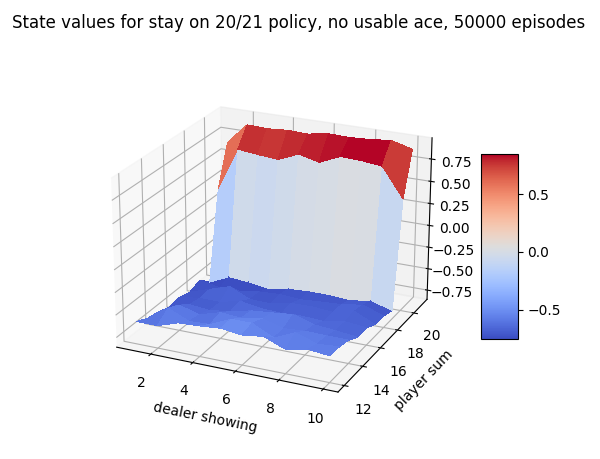
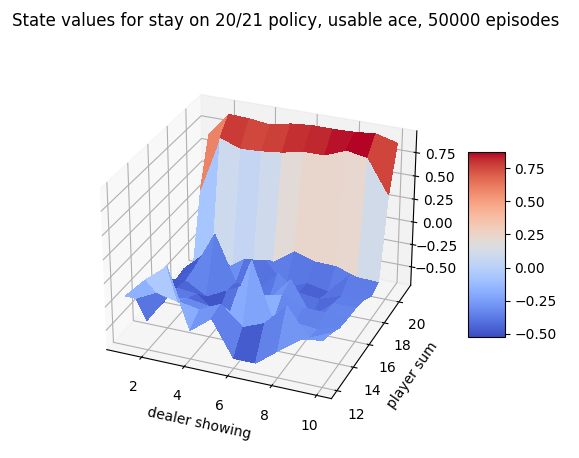
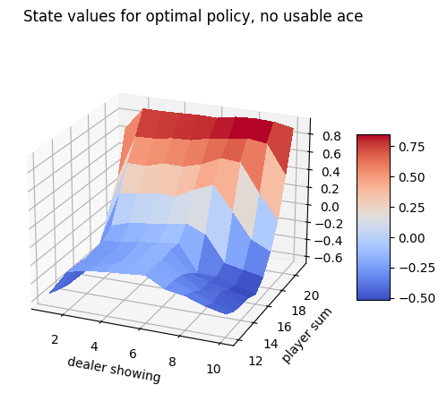
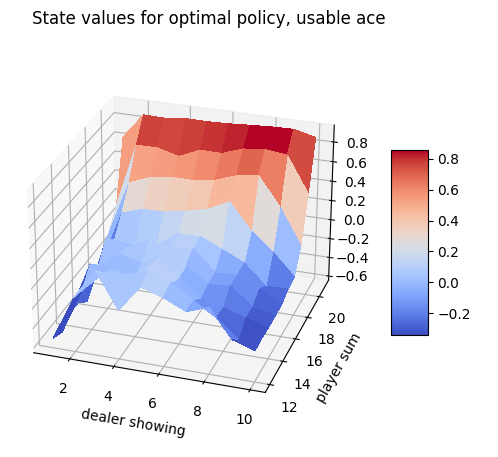

# blackjack RL playground

Testing monte carlo RL methods on blackjack. Following chapter 5 of
[Reinforcement learning, an introduction](https://www.goodreads.com/book/show/739791.Reinforcement_Learning)

Uses [ai gym](https://gym.openai.com/docs/) and python.


# setup

python 3+ (tested with 3.8)

```sh
python -m venv .  # if you've just cloned the repo
. Scripts/activate
pip install -r requirements.txt
./run_tests.sh
python demo.py
```


# Blackjack policy evaluation using first visit Monte Carlo estimation

To estimate the expected return for a given policy, the Monte Carlo method
consists of playing (or simulating) many games of blackjack. The reward for a
win is +1, a draw is 0, a loss is -1. For each state that occurs in a game, the
reward of that game is tallied against that state. This project only records the
reward against the first occurrence of a state in each game. This is called
'first visit' Monte Carlo. The estimated return for each state is the average
of all rewards recorded against that state.

The estimates for a policy of only staying (or sticking) on 20 or 21 is shown
below.






# Blackjack policy optimisation using Monte Carlo with exploring starts

This method consists of playing (or simulating) many games of blackjack. The
reward for a win is +1, a draw is 0, a loss is -1. For each state that occurs in
a game, the reward of that game is tallied against that state. This project only
records the reward against the first occurrence of a state in each game. This is
called 'first visit' Monte Carlo.

Before any games are played, a random policy is created. As more games are
played, the policy is improved by, for each state, choosing the action that has
the best average reward recorded against it. The first action of each game is
chosen randomly, to ensure all possible game states are visited. This strategy is
called 'exploring starts'. The starting game state is already uniformly random,
which ensures all states will be encountered.

The optimal policy found by this project is visualised below. This will vary
each run, due to the random nature of MC, unless you want to run it to
convergence. This will take a very long time, as I haven't done any of the
suggested optimisations. Note that to get similar results below, you'll want to
increase the number of games player to around 500k. This took about a minute to
run on my machine.





```
no usable ace:

21 S S S S S S S S S S 
20 S S S S S S S S S S 
19 S S S S S S S S S S 
18 S S S S S S S S S S 
17 S S S S S S S S S S 
16 H S S S S S H H H S 
15 H S S S S S H H H H 
14 H S S S S S H H H H
13 H H S S S S H H H H
12 H H S H H H H H H H
   1 2 3 4 5 6 7 8 9 10  dealer showing

usable ace:

21 S S S S S S S S S S
20 S S S S S S S S S S
19 S S S S S S S S S S
18 S S S S S S S S H S
17 H H H H H H H H H H
16 H H H H H H H H H H
15 H H H H H H H H H H
14 H H H H H H H H H H
13 H H H H H H H H H H
12 H H H S H H H H H H
   1 2 3 4 5 6 7 8 9 10  dealer showing
```
